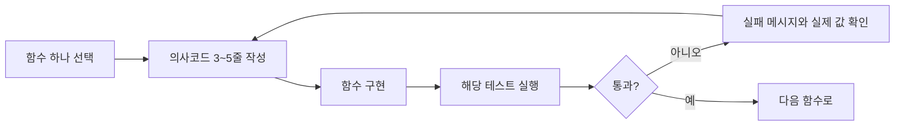

# W02 VS Code 구현과 검증

이 문서는 **구현 안내 + 검증 안내**다. 현재 세 구현 파일의 함수는 일부러 비어 있고 `NotImplementedError`를 낸다. 이는 오류가 아니라, 네가 채울 순서를 드러내는 시작 상태다.

## 1. VS Code에서 열 파일

```text
experiments/wk02/
├── search.py           # DFS, BFS, A*
├── game_search.py      # minimax, alpha-beta
└── rule_inference.py   # 전향/후향 추론
tests/
├── test_search.py
├── test_minimax.py
└── test_rule_inference.py
```

왼쪽은 네가 작성하는 파일이고, 오른쪽 `tests/`는 “이 함수가 이런 결과를 내야 한다”는 자동 채점표다.

## 2. 구현 → 확인의 순서



처음에는 테스트가 실패한다. 예를 들어 `neighbors()`가 비어 있으므로 `test_search.py`가 실패한다. `NotImplementedError`가 사라지고 테스트가 초록색 통과가 되면, 그 함수의 가장 기본 동작은 확인된 것이다.

## 3. 첫 구현: search.py

다음 순서만 지킨다.

1. `neighbors()` - 현재 칸의 상하좌우 중 맵 안에 있고 벽이 아닌 칸만 반환한다.
2. `manhattan()` - 행 차이의 절댓값 + 열 차이의 절댓값을 반환한다.
3. `reconstruct_path()` - 목표에서 부모를 따라가 경로 순서를 뒤집는다.
4. `bfs()` - 큐를 사용한다. 먼저 BFS를 완성하면 “최단 경로 비용 8”이라는 기준이 생긴다.
5. `dfs()` - 스택으로 교체하고 결과 차이를 관찰한다.
6. `a_star()` - 우선순위 큐와 `f=g+weight*h`를 넣는다.

### 실행 명령

PowerShell에서 저장소 루트로 이동해 실행한다.

```powershell
.\.venv\Scripts\python.exe -m pytest -q tests/test_search.py
```

예상 흐름은 `실패 → neighbors/manhattan 통과 → BFS 통과 → A* 통과`다. 가중 A*는 유효한 경로를 찾는지만 먼저 검사한다. 최단 경로인지와 확장 노드 수는 보고서에서 실제 결과로 비교한다.

## 4. game_search.py

`DEMO_TREE`에는 이미 깊이 2의 작은 트리가 있다. 숫자는 말단 점수이며, `root`는 MAX, 그 다음 A/B는 MIN이다.

1. `minimax()`에서 숫자 노드면 숫자를 반환한다.
2. MAX면 자식 중 가장 큰 값, MIN이면 가장 작은 값을 반환한다.
3. 방문할 때마다 `stats.visited`를 1 늘린다.
4. 그 후 `alpha_beta()`에 alpha/beta 갱신과 잘린 가지 수 `stats.pruned`를 넣는다.

```powershell
.\.venv\Scripts\python.exe -m pytest -q tests/test_minimax.py
```

통과 기준은 **두 알고리즘의 최종 점수는 3으로 같고**, alpha-beta의 방문 수가 minimax보다 많지 않으며, 이 예제에서는 적어도 한 가지를 생략하는 것이다.

## 5. rule_inference.py

1. `forward_chain()`은 현재 사실로 규칙의 조건이 모두 참인지 확인한다.
2. 새 결론만 사실 집합에 추가한다. 새 사실이 없으면 멈춘다.
3. `backward_chain()`은 목표를 만드는 규칙을 찾고, 그 규칙의 조건을 다시 목표처럼 확인한다.
4. 이미 확인 중인 목표를 기록해 순환을 막는다.

```powershell
.\.venv\Scripts\python.exe -m pytest -q tests/test_rule_inference.py
```

통과 기준은 두 방식 모두 `이동 속도가 느려진다`를 얻고, 순환 규칙이 있어도 멈추는 것이다.

## 6. 모든 W02 테스트

```powershell
.\.venv\Scripts\python.exe -m pytest -q tests/test_search.py tests/test_minimax.py tests/test_rule_inference.py
```

테스트 통과는 “예제에서 기본 동작이 맞다”는 뜻이다. 학습 완료는 아니다. 마지막에는 각 알고리즘을 실행해 `경로 비용`, `확장 노드 수`, `frontier 최대 크기`, `방문/가지치기 수`, `검사한 규칙 수`를 [W02 보고서](../reports/REPORT_wk02.md)에 실제 값으로 적는다.

## 7. 막혔을 때 보내면 좋은 것

코드를 통째로 붙이지 말고 아래 넷을 보내면 정확히 리뷰할 수 있다.

1. 작성한 함수 하나
2. 실행한 명령
3. 실패 메시지 전체
4. 예상한 결과와 실제 결과
