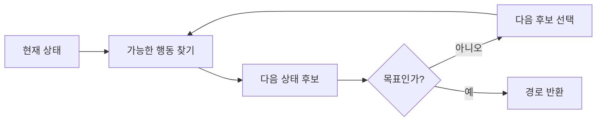

# W02 오늘 수업 예습 - 탐색·게임 AI·추론

> 예상 시간: 15~20분
> 오늘의 목표: **AI가 정답을 찾기 위해 후보를 어떤 순서로 살펴보는지** 설명한다.

AI 역사, 인물, 연대표는 다루지 않는다. 오늘 수업에서 문제를 풀 때 필요한 개념만 본다.

## 수업의 큰 방향

이번 학기에는 퍼셉트론과 MLP에서 시작해 CNN, RNN/LSTM, 오토인코더, VAE, GAN처럼 딥러닝에서 자주 쓰이는 모델을 차례로 배운다. 각 모델이 **어떤 데이터 문제를 풀고, 왜 그 구조가 필요한지**를 작은 실습으로 확인하는 수업이다.

현재 널리 쓰이는 ChatGPT 같은 모델은 대체로 **Transformer 기반**이다. 다만 이 수업에서는 Transformer를 처음부터 구현하지 않는다. RNN/LSTM 수업에서 Transformer·LLM과의 연결을 개념 수준으로 이해하고, 그 전에 필요한 신경망·CNN·시퀀스 모델·생성 모델의 기초를 단단히 만든다.

| 이번 학기에 직접 다루는 흐름 | 이번 학기의 Transformer 범위 |
|---|---|
| MLP → CNN → RNN/LSTM → AE/VAE → GAN | 왜 Transformer가 등장했는지와 기존 모델과의 연결 이해 |

그래서 오늘의 탐색·게임 AI·규칙 추론은 Transformer를 배우기 위한 구현 단계는 아니다. AI가 문제를 표현하고 답을 고르는 여러 방식 중 하나를 이해하는 출발점이다.

## 1. 먼저 떠올릴 문제

게임 캐릭터가 벽을 피해 보물까지 가야 한다고 하자. 모든 길을 아무 순서로나 확인하면 도착할 수는 있지만, 맵이 커지면 너무 오래 걸린다. 그래서 다음 세 가지가 필요하다.

1. 현재 상황을 정확히 표현한다.
2. 다음에 살펴볼 후보를 고르는 규칙을 정한다.
3. 목표에 가까워 보이는 방향을 추정한다.

이 과정을 **탐색(search)**이라고 한다.

## 2. 문제를 상태공간으로 바꾸기

| 말 | 쉬운 뜻 | 미로 예시 |
|---|---|---|
| 상태 `state` | 지금 상황 | 현재 위치 `(2, 3)` |
| 행동 `action` | 다음 상황으로 바꾸는 선택 | 위·아래·왼쪽·오른쪽 이동 |
| 시작 상태 | 출발점 | 입구 |
| 목표 검사 | 도착했는지 확인 | 현재 위치가 보물 칸인가? |
| 경로 비용 `g(n)` | 출발부터 현재까지 쓴 비용 | 지금까지 이동한 칸 수 |
| 휴리스틱 `h(n)` | 목표까지 남은 비용의 추정값 | 가로 차이 + 세로 차이 |

**지능형 에이전트**는 주변 상황을 입력받고, 목표를 이루기 위한 행동을 선택하는 프로그램이다. 미로에서는 맵과 현재 위치를 보고 다음 이동을 고르는 캐릭터가 에이전트다.



## 3. DFS·BFS·A*의 차이

세 방법의 핵심 차이는 **다음에 어느 후보를 꺼내느냐**다.

| 방법 | 후보 선택 방법 | 장점 | 조심할 점 |
|---|---|---|---|
| DFS | 한 방향으로 가능한 만큼 깊게 간다 | 메모리를 비교적 적게 쓴다 | 가까운 답을 지나칠 수 있다 |
| BFS | 시작점에서 가까운 순서로 본다 | 모든 이동 비용이 같으면 최단 경로를 찾는다 | 후보를 많이 저장할 수 있다 |
| A* | 지금까지의 비용과 남은 비용 추정을 더해 고른다 | 좋은 추정값이 있으면 불필요한 탐색을 줄인다 | 추정값의 성질에 따라 최적 경로 보장이 달라진다 |

### 작은 A* 계산

A*는 보통 다음 값을 비교한다.

\[
f(n) = g(n) + h(n)
\]

- 후보 A: 지금까지 3칸, 남은 거리 추정 4칸 → `f(A) = 3 + 4 = 7`
- 후보 B: 지금까지 5칸, 남은 거리 추정 1칸 → `f(B) = 5 + 1 = 6`

A*는 `f`가 더 작은 **B를 먼저 확인**한다. B는 지금까지 더 멀리 왔지만, 목표에 훨씬 가까워 보이기 때문이다.

> 기억할 것: `g`는 실제로 쓴 비용이고, `h`는 아직 쓰지 않은 비용의 추정이다.

### 1분 빈칸

1. `h(n)=0`이면 A*는 남은 거리를 전혀 고려하지 않는다. 이때 비용이 작은 경로부터 보는 탐색인 `________`와 같은 방식이 된다.
2. 모든 간선 비용이 1일 때 최단 경로를 보장하는 것은 DFS / BFS 중 `________`이다.
3. 휴리스틱이 실제 남은 최단 비용보다 크게 추정하지 않는 성질을 **과대평가하지 않는다**고 표현한다.

힌트: 1번의 답은 비용이 모두 1이면 BFS와 같은 순서가 될 수 있는 **균일 비용 탐색**이다.

## 4. 게임 AI: minimax와 alpha-beta

미로 탐색은 내가 움직인 결과만 생각하면 된다. 보드게임에서는 내가 움직인 뒤 **상대도 자신에게 가장 좋은 수를 둔다**고 생각해야 한다.

- `MAX`: 내 점수를 가장 크게 만드는 수를 선택한다.
- `MIN`: 상대가 내 점수를 가장 작게 만드는 수를 선택한다고 가정한다.
- `minimax`: MAX와 MIN을 번갈아 적용해 현재의 최선 수를 고른다.

### 숫자 4개로 계산

내가 A 또는 B를 선택할 수 있고, 그 뒤 상대가 결과를 고른다고 하자.

- A의 결과 점수: `3`, `5` → 상대는 나에게 불리한 `3` 선택
- B의 결과 점수: `2`, `9` → 상대는 나에게 불리한 `2` 선택
- 나는 `max(3, 2)`를 계산해 **A를 선택**한다.

`alpha-beta pruning`은 최종 선택을 바꾸지 않는 가지를 더 보지 않고 건너뛴다. 계산을 생략할 뿐, 같은 트리와 평가값에서는 minimax와 같은 최적 값을 내야 한다. 좋은 수를 먼저 살펴보면 더 많은 가지를 생략할 수 있다.

### 확인 문제

상대가 실수해서 항상 `9`를 골라줄 것이라고 기대하면 왜 위험할까?
내 답: `__________________________________________________`

## 5. 지식표현과 추론

탐색이 여러 경로에서 답을 찾는 방법이라면, **추론**은 알고 있는 사실과 규칙으로 새로운 결론을 얻는 방법이다.

```text
사실: 비가 온다.
규칙 1: 비가 오면 길이 젖는다.
규칙 2: 길이 젖으면 이동 속도가 느려진다.
결론: 이동 속도가 느려진다.
```

| 방식 | 출발점 | 위 예시에서의 질문 |
|---|---|---|
| 전향 추론 | 알고 있는 사실 | `비가 온다`에서 무엇을 새로 알 수 있나? |
| 후향 추론 | 확인하려는 목표 | `이동 속도가 느리다`를 증명하려면 무엇이 필요한가? |

규칙이 많아지면 같은 사실을 반복 확인하거나 규칙이 서로 순환할 수 있다. 따라서 이미 확인한 사실을 기록하고, 지식과 추론 절차를 구분해야 한다.

### 1분 빈칸

목표가 `NPC가 도망간다`일 때 그 결론에 필요한 조건을 거꾸로 찾는 방식은 `________ 추론`이다.

## 6. 탐색과 학습을 구분하기

| 탐색 | 학습 |
|---|---|
| 상태와 이동 규칙이 주어져 있다 | 데이터에서 판단 규칙을 조정한다 |
| 후보를 살펴보며 답을 찾는다 | 손실을 줄이도록 매개변수를 바꾼다 |
| 예: 미로의 A* | 예: 이미지 분류 신경망 |

게임 AI 하나에도 둘을 함께 쓸 수 있다. A*가 이동 경로를 찾고, 학습 모델이 적의 행동을 예측하는 식이다.

## 7. 수업 중 잡아야 할 질문

강의를 들으며 아래 네 가지에 표시한다.

- [ ] 수업에서는 상태와 행동을 어떤 예제로 설명했는가?
- [ ] A*의 휴리스틱이 최적 경로를 보장하려면 어떤 조건이 필요한가?
- [ ] alpha-beta가 가지를 생략하는 조건을 숫자로 설명할 수 있는가?
- [ ] 전향 추론과 후향 추론은 각각 언제 유리한가?

오늘은 두 딥러닝 교재의 본문이 중심이 아니다. Python·NumPy 또는 PyTorch 문법이 막힐 때만 기초 부분을 참고한다.

## 8. 수업 직전 최종 확인

다음 다섯 문장을 자료 없이 말할 수 있으면 예습 완료다.

1. 상태와 행동의 차이
2. DFS·BFS·A*가 다음 후보를 고르는 기준
3. `f(n)=g(n)+h(n)`에서 세 기호의 의미
4. minimax가 상대의 선택을 계산하는 방법
5. 전향 추론과 후향 추론의 출발점

정답 확인용 핵심어: **현재 상황 / 상태 변화 / 깊이 / 가까운 순서 / 실제 비용+추정 비용 / 상대의 최선 대응 / 사실 / 목표**
